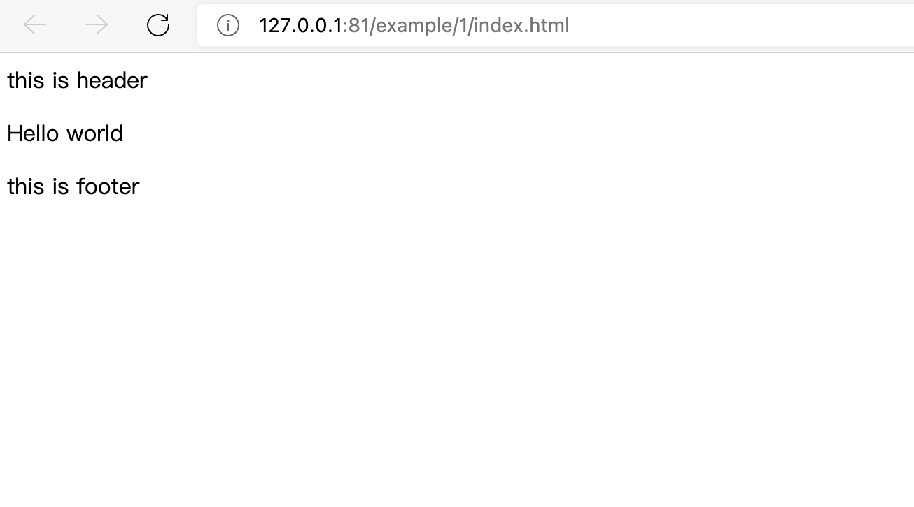

# 界面模块化与路由
好了，现在我们可以开始第一份 tmpUI 程序了。为了方便行事，我已经提前把这个项目的源代码放置到了 github 仓库。  
这个项目很简单，传统艺能 hello world。 在 vscode 中安装 live server 插件，然后可以直接启动它，你应该会看到这样的界面。  



## 静态路由
在这个例子中，打开 `/example/1/index.html` ，可以看到程序的配置是这样的:

```javascript
var app = new tmpUI({
   "googleAnalytics": "G-4DGYKM9EHS",
   "loadingIcon": "/tpl/img/logo.png",
   "loadingPage": true,
   "loadingProgress": true,
   "path": {
       "/": {
           "title": "tmpUI App!",
           "body": {
               "./tpl/index.html": { "type": "html", "target": { "type": "body" } },
               "./tpl/header.html": { "type": "html", "target": { "type":"id","val":"tpl_header" } },
               "./tpl/footer.html": { "type": "html", "target": { "type":"id","val":"tpl_footer" } }
            }
        }
    }
});
```
这里重点要讲解的是 `path` 参数，`path` 参数用于配置静态路由。其结构如代码中所示。   
其中 `"/" : {}` 表示配置 `/` 路径下的页面。如下参数

| 参数 | 说明 | 例子 |
|-----|-----|-----|
|title | 页面标题 | "tmpUI App!" |
|body | 页面内容 | ```{ "./tpl/index.html": { "type": "html", "target": { "type": "body" } } }``` |
| append | 可选项，置入的后置资源组，这里仅需要填入后置资源组名称 | ```["append_res"]``` |
| preload | 可选项。 置入的前置资源组，这里仅需要填入前置资源组的名称 | ```["preload_res"]``` |

## 资源组

`body` 中使用 `资源组` 来组织要在其中放入什么。可以理解为 `include` 或者 `require`。 

以代码为例  

`"./tpl/index.html": { "type": "html", "target": { "type": "body" } }`  

其中，`"./tpl/index.html"` 作为资源的实际路径，其值为具体的属性描述
当资源文件是 `html` 时，需要在属性描述中，将 `type` 设置为 `html`，这样 `tmpUI` 引擎会
将这个资源作为 `html` 代码写入到页面中，具体要写入到哪里，则由 `target` 决定。  

需要注意的是，如果在 `html` 文件中写入了 `<script> ... </script>` 标签，不会生效，这是个例外。  
因此，所有 `Javascript` 代码都应该被封装到单独的文件中，然后通过 `资源组` 来添加到页面中。

| 组合 | 说明 |
|-----|-----|
|`"target":{"type":"body" }}`|此资源将写入到 `tmpui_body` 中|
|`"target":{"type":"id", "val":"dom"}}`|此资源将替换到指定 `id` 的 `DOM` ，`id` 由 `val` 指定。注意，这里是替换|

在本例中，我们通过 `target : body` 来设定整个页面的基本模板，然后通过 `target : id` 来给页面设定模板的头部和页底。  

如果要在每个路由中都这么配置，那会很累，所以，在下一个列子中，将介绍使用 "前置资源 组" 和 "后置资源组" 来批量完成这一任务。

## 前置与后置资源组

### 1，加载顺序

如果要在很多页面上嵌入很多的文件或资源，在 `PHP` 中，你可以在某个 `header` 文件中再 包含另外一份 `PHP` 文件。而在 `tmpUI` 中稍许不同，我们采用更快捷的方式：`前置`和`后置`资源组。  
`tmpUI` 加载资源文件时，是按这样的顺序加载的，这与一般的浏览器基本一致。 

`前置资源组(preload) -> 主体(body) -> 后置资源组(append)`


在上面的 `例子1` 中，由于我们没有配置前置资源组和后置资源组，因此只加载了 `body` 中设 置的资源组。现在，我们要稍微改变一下代码，加入 `bootstrap`。`bootstrap` 将被设置到 前置资源组。以下是变更后的代码 ( 代码可在 `example 2` 中获取 ):

```javascript
var app = new tmpUI({
   "googleAnalytics": "G-4DGYKM9EHS",
   "loadingIcon": "/tpl/img/logo.png",
   "loadingPage": true,
   "loadingProgress": true,
   "preload": {
       "bootstrap": {
           "/tpl/plugin/bootstrap4/jquery.min.js": { "type": "js", "reload": false },
           "/tpl/plugin/bootstrap4/bootstrap.bundle.min.js": { "type": "js", "reload":false },false },
       }
       "/tpl/plugin/bootstrap4/bootstrap.min.css": { "type": "css", "reload":
       "/tpl/css/reset.css": { "type": "css", "reload": false },
    }, "path": {
       "/": {
           "title": "tmpUI App!",
           "preload":["bootstrap"],
           "body": {
               "./tpl/index.html": { "type": "html", "target": { "type": "body" } },
               "./tpl/header.html": { "type": "html", "target": { "type": "id", "val":"tpl_header" } },
               "./tpl/footer.html": { "type": "html", "target": { "type": "id", "val":"tpl_footer" } } 
            }
        } 
    }
);
```