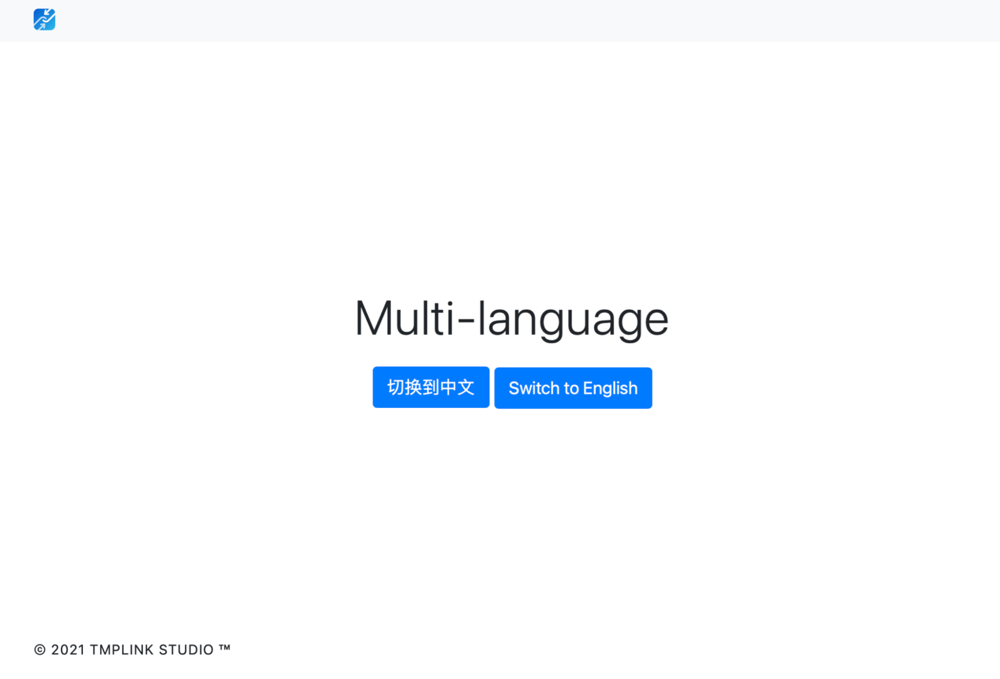

# Advanced: Multilingual Support

Multi-language support is almost all template engine problems, we try to take a more eclectic solution.     
Multilingualism usually
There are two problems: `render on load` and `render after load`. All the code involved in this section is available in `/example/4`.



## Rendering on load

First, let's tackle the first problem: load-time rendering.
Load-time rendering in this case is the timeline when the page is ready after it has been loaded. We write content to the specified `DOM` object via the `i18n` tag, like this：
```html
<div i18n="index_title">.</div>
```
Please note that the `. ` is a required character, and will not be rendered without it. `index_title` is the language tag in the corresponding language file (the format of the language file will be explained later).
Load-time rendering is done `automatically` after the page is loaded.

## Rendering after loading

The second problem: post-load rendering. Many times, page content is requested after loading, such as the user's billing information. So how do you handle the language rendering of these templates?
It's simple, call once 
```javascript
tmpUI.languageBuild() 
```
This function renders the page once.

## Real-time language change
The same can be done when changing the language for the interface. While most templates require a page refresh to change the language, `tmpUI` does not, and only requires running `tmpUI.languageSet(code for the target language)` once.   

# Language files
A language file is a `JSON` formatted file, which is organized in `"language tag": "content"` format. For example, for the `i18n="index_title"` mentioned above, you need to include `"index_title": "This is the home page title"` in the language file in order to populate the content correctly at the target location.    
To apply the multilingual configuration correctly, you also need to set the multilingual parameters in the `tmpUI` initialization parameters.
Here is a sample code：

```json
"language":{
   "en":"./lang/en.json",
   "cn":"./lang/cn.json",
},
```

where `en` and `cn` are the language codes, followed by the path to the corresponding language file.

# Auto-detection and default settings
The language engine of `tmpUI` automatically detects the language of the browser when the page is initialized, and automatically sets the file with the corresponding language code.

| Language Code | Target Language |
| ---------- | ---------- |
| `en` | English |
| `cn` | Chinese |
| `jp` | Japanese |
| `kr` | Korean |
| `fr` | French |
| `de` | German
| `ms` | Malay
| `ru` | Russian |

The language engine takes the set language code and stores it in `localStorage` with the key name `tmpUI_language`. It will be called on the next access.      

If the browser detects a language whose language code is not configured in the program configuration, it will change the language code to the value set by `languageDefault`, which defaults to `en` if it is not configured.