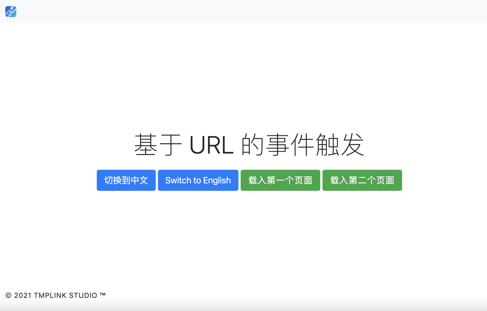

# Dynamic events that follow the route

This is the latest feature of tmpUI!  

In the desktop module of `tmp.link`, we want to implement an effect that when a subfolder is clicked, some specific code is executed and the `URL` follows the change to the actual `URL`, but the actual page does not need to be refreshed completely, but the contents of the folder are updated by specific code.

To achieve this effect, two adjustments need to be made. First, `tmpUI` itself has to support, for a specific `a` tag, getting the value of `tmpui-action` in the `a` tag, and this value is the code we want to execute. tmpUI listens to the click event of the set `a` tag, and when it is clicked, it first sets the value of the `href` property in the `a` tag to the address bar, accomplishing the first goal: changing the actual URL. then, it executes the `javascript` code in the `tmpui-action` property. Accomplishes the second goal: executes the specific code.

[demo effect](. /video/demo.mp4)

With the above explanation, I think you should be able to understand what kind of scenarios it is suitable for and have a general idea of how to use it.  
Of course, we also prepared the code `/examples/6`, follow the code to implement it.



In the html code, add tmpui-action to the a tag and set the code to be executed in its value：

```html
<a class="btn btn-success btn-lg" i18n="index_btn_goto_page1" tmpui-action="gotoPage1()" href="/page1.html">.</a>
<a class="btn btn-success btn-lg" i18n="index_btn_goto_page2" tmpui-action="gotoPage2()" href="/page2.html">.</a>
```

In this example, `gotoPage1()` and `gotoPage2()` are the launch functions to jump to other pages. The `URL` adjustment is done by `tmpUI`, while loading other pages (to achieve local refresh) can be done by the two functions mentioned above.   

In practice, these two functions can be designed to read certain specific parameters in the `URL` and then adjust the content to be displayed according to those parameters.