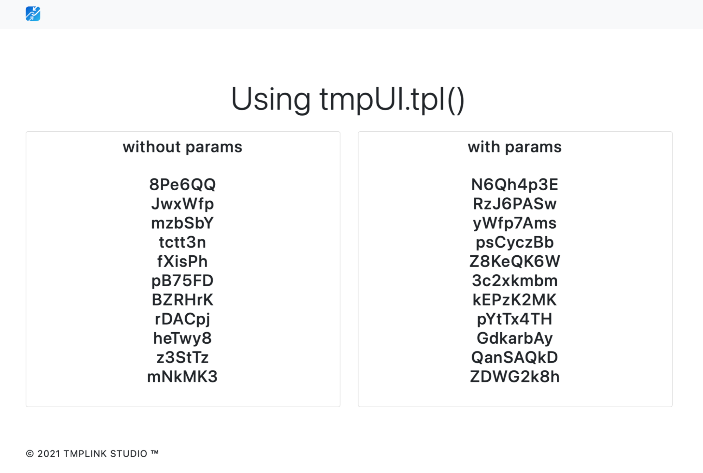

## Advanced: Embedded Templates

## Using embedded code tags

Sometimes, we need to perform some piggyback logic in a page, such as generating a list. In this case, using native `JS` code directly is of course the best, and `tmpUI`'s own template engine can do this.  

`tmpUI` does this through `<% . . your code %>` to embed `JavaScript` code, which is almost identical to the style of `PHP`, so if you've used `PHP` before, what happens next should be easy.  

The template parsing function is located at `tmpUI.tpl(DOM-id,Params)` The first parameter is the `DOM-id` of the template file, and the second parameter is optional and can be passed to the template, which is accessed within the template using the variable `obj`. This function will return the parsed `html` code, which you can then insert anywhere in the page.

## Generate a list
First, we need to prepare the template code, this time we will prepare two ways to write it, with and without parameters. The template code is usually placed directly on the page, but of course, you can place it on a separate page, remembering to load it into the `body`.

```html
<script type="text/template" id="tpl_no_array">
    <ul class="list-unstyled">
       <% for(let i = 0;i<=10;i++){ %>
            <li><% randomString(6) %></li>
        <% } %>
    </ul>
</script>
<script type="text/template" id="tpl_with_object">
    <ul class="list-unstyled">
        <% for(let i in obj){ %>
            <li><% obj[i] %></li>
        <% } %>
    </ul>
</script>
```

Then, we need to prepare a `JavaScript` file that will perform the template parsing operation when the page is loaded. The code for this file is as follows.

```javascript
app.ready(()=>{
   //without params
   let html1 = app.tpl('tpl_no_array');
   document.querySelector('#no_array').innerHTML = html1;
   //with params
   let params = [];
   for(let i =0;i <= 10;i++){
       params.push(randomString(8));
   }
   let html2 = app.tpl('tpl_with_object', params);
   document.querySelector('#with_object').innerHTML = html2;
});
```

The above code can be found in `example 3`, run the code in `example 3` and you should get a screenshot of the interface like this:



